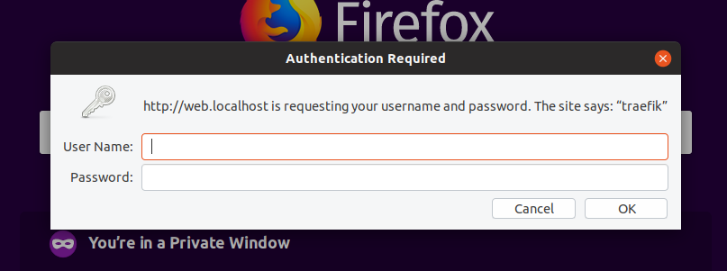

# Template for local traefik development
This is a basic docker-compose and toml for [Traefik](https://docs.traefik.io/) to create a development environment. The applications in the compose file are just in place for proof of concept.  Replace them for your needs.

## Pre-Flight rules
1. Clone and change into the directory
2. You must create the docker network before bringing up the environment.  
`docker network create proxy`
3. Run the command `docker-compose up` to view the logs or `docker-compose up -d` for it to run in the background.

## Docker-compose
1. Static nginx website at http://localhost
2. Influxdb 2.0 at http://influx.localhost
3. Dashboard with basic auth http://web.localhost  Login info (admin:supersecret)

## Developing
If you want to replace the admin login information in the traefik.toml you will need to install htpasswd.


```
sudo apt-get install apache2-utils -y
htpasswd -nb <user> <secret_password>
admin:$apr1$A3524hz3$4k45BqlgN1aiwOs1pjMD9. <--user:admin password:supersecret
```
Copy and replace that information in the toml.  

Shortly I will add on how to configure automatic ssl.  